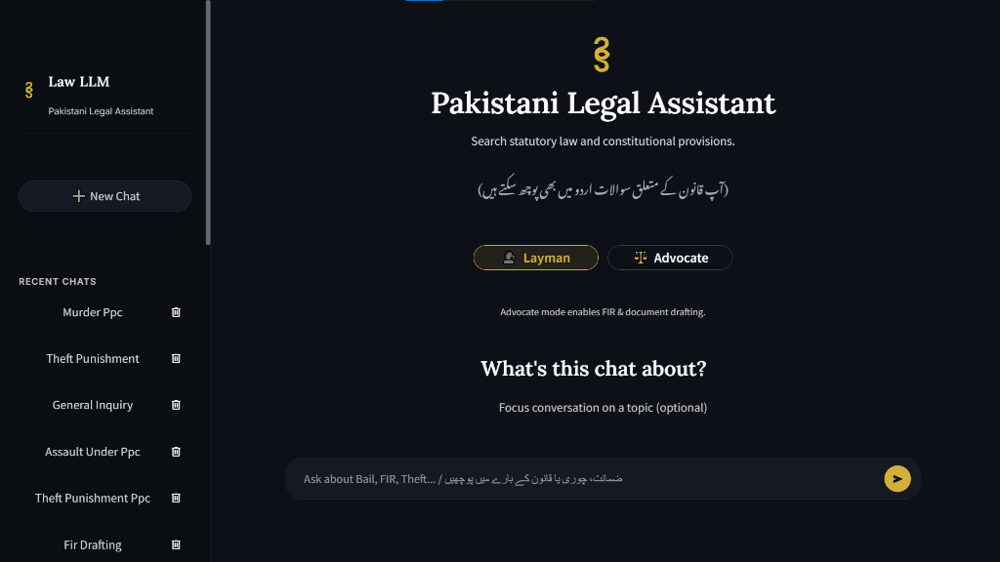
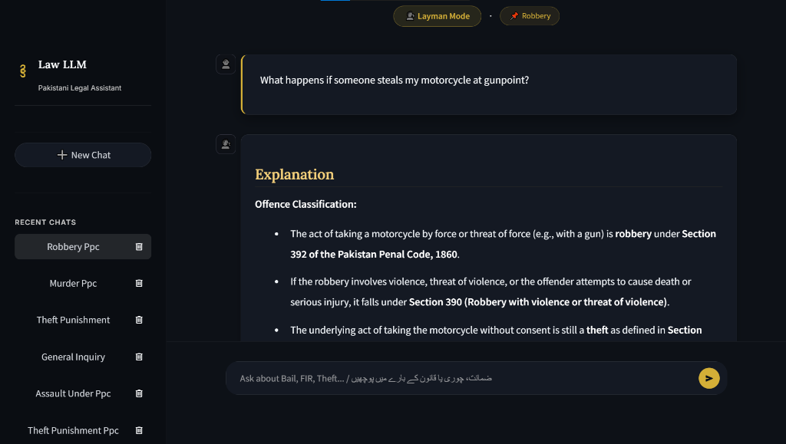
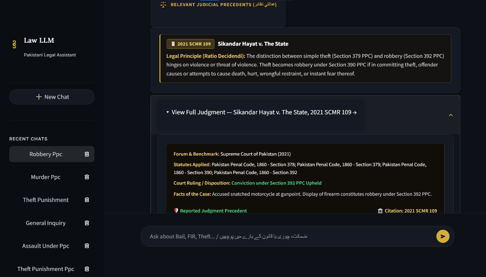

<div align="center">


# Law LLM — Pakistani Legal Assistant

### _Your AI-Powered Gateway to Pakistani Law_

[](https://python.org)
[](https://streamlit.io)
[](https://groq.com)
[](LICENSE)

**Ask a question in English, Urdu, or Roman Urdu → Get a cited, grounded answer from the actual text of Pakistani law.**

No hallucinations. No invented sections. Every answer traceable to a real statute.

<br>

| | |
|:---:|:---:|
|  |  |
| _Hero Landing — Mode Selection & Topic_ | _Cited Answer with Case Precedents_ |

</div>

---

## ⚡ The Problem

> _"What happens if someone steals my phone?"_ <br>
> _"ضمانت کیسے ملتی ہے؟"_ <br>
> _"Draft an FIR for robbery at gunpoint"_

Pakistani citizens, law students, and even advocates struggle to quickly find the **exact legal provisions** that apply to their situations. Generic AI chatbots hallucinate fake section numbers. Legal databases require expert search skills. Law LLM bridges this gap.

---

## 🎯 What It Does

```
❯ "What happens if someone steals my phone?"
  → PPC § 378 (Theft) + § 379 (Punishment) — plain English explanation

❯ "ضمانت کیسے ملتی ہے؟"
  → CrPC § 497 + § 498 — full answer in Urdu script (نستعلیق)

❯ "Draft an FIR for cheating"
  → Formal FIR application with placeholders, cited under PPC § 420
```

<div align="center">

| Metric | Value |
|:---|:---:|
| 🎯 **Retrieval Accuracy** | **100%** (31/31 eval set) |
| 📊 **Baseline Before Pipeline** | 74.2% |
| 📚 **Statutory Sections Indexed** | 500+ chunks |
| ⚖️ **Landmark Cases** | 100 judgments |
| 🌐 **Languages** | English · Urdu · Roman Urdu |

</div>

---

## 📜 Legal Knowledge Base

| Act | What's Covered |
|:---|:---|
| **Pakistan Penal Code, 1860** | All major offences — murder, theft, fraud, robbery, hurt, kidnapping, defamation |
| **Code of Criminal Procedure, 1898** | FIR filing, arrest, bail, investigation, trial procedure |
| **Constitution of Pakistan, 1973** | Fundamental Rights — Articles 8 through 28 |

> 📖 Sourced exclusively from [pakistancode.gov.pk](https://pakistancode.gov.pk) and [na.gov.pk](https://na.gov.pk)

### 📂 Judicial Precedents Library

- **100 landmark judgments** from the Supreme Court & High Courts
- Citation formats: `SCMR` · `PLD` · `PCrLJ` · `CLC`
- Coverage: Bail (§ 497/498), Murder (§ 302), FIR Law (§ 154), Religious Offences (§ 295-C), Cheque Dishonor (§ 489-F), Fundamental Rights (Arts. 9, 10A, 14, 199)
- Each case includes **Ratio Decidendi** extraction — the core legal principle — in English and Urdu

<div align="center">

  
_Interactive Judicial Precedent Card with Supreme Court Ratio Decidendi & Judgment Details_

</div>

---

## 🧠 How It Works — The RAG Pipeline

```
                    ┌──────────────────────────┐
                    │     User Query           │
                    │  (English / Urdu / Roman) │
                    └────────────┬─────────────┘
                                 │
                    ┌────────────▼─────────────┐
                    │  1. Query Normalization   │  Urdu → English translation
                    │     & Language Detection  │  Roman Urdu handling
                    └────────────┬─────────────┘
                                 │
                    ┌────────────▼─────────────┐
                    │  2. Exact Section Match   │  "Section 302 PPC" → Direct
                    │     (Alias Resolution)    │  lookup, zero ambiguity
                    └────────────┬─────────────┘
                                 │
                    ┌────────────▼─────────────┐
                    │  3. Hybrid Search Fusion  │  Dense (BAAI/bge-small-en)
                    │     (Dense + Sparse)      │  + Sparse (BM25)
                    └────────────┬─────────────┘
                                 │
                    ┌────────────▼─────────────┐
                    │  4. Cross-Encoder         │  ms-marco-MiniLM re-ranks
                    │     Re-Ranking            │  top candidates by relevance
                    └────────────┬─────────────┘
                                 │
                    ┌────────────▼─────────────┐
                    │  5. LLM Generation        │  qwen3.6-27b → compound
                    │     + Fallback Chain       │  → gpt-oss-20b
                    └──────────────────────────┘
```

> **Cross-Act Disambiguation**: The pipeline automatically resolves confusing overlaps — e.g., *PPC § 497* (Adultery) vs *CrPC § 497* (Bail) are never mixed up.

---

## 🗣️ Dual-Mode Engine

<table>
<tr>
<td width="50%" valign="top">

### 🗣️ Layman Mode
_For citizens, students, litigants_

- ✅ Plain-English explanations
- ✅ Step-by-step legal guidance
- ✅ Urdu responses in نستعلیق script
- ✅ Simplified legal terminology
- ❌ Document drafting (redirected to Advocate)

</td>
<td width="50%" valign="top">

### ⚖️ Advocate Mode
_For lawyers, legal advisors, practitioners_

- ✅ Section-by-section statutory analysis
- ✅ Case briefs with precedent citations
- ✅ **FIR Drafting** (§ 154 CrPC)
- ✅ **Bail Petitions** (§ 497/498 CrPC)
- ✅ Court-ready document templates

</td>
</tr>
</table>

> 💡 Mode locks into a compact header badge after the first prompt — no accidental switches during a legal conversation.

---

## 🎨 UI Highlights

| Feature | Description |
|:---|:---|
| **Hero Landing** | Clean entry with mode selection (Layman/Advocate) and optional topic tagging |
| **Mode Lock Badge** | Compact `🗣️ Layman Mode` or `⚖️ Advocate Mode` badge persists after first prompt |
| **Floating Gold Loader** | Animated spinner with contextual status messages during retrieval |
| **Citation Boxes** | Multi-paragraph statutory excerpts in styled, collapsible containers |
| **Case Precedent Cards** | Interactive cards with case summary, ratio decidendi, and applicable statutes |
| **Session History** | Multi-session management with AI-generated legal topic titles |
| **RTL Support** | Full right-to-left rendering for Urdu responses with proper نستعلیق typography |

---

## 🔧 Technology Stack

| Layer | Technology |
|:---|:---|
| **LLM (Primary)** | `qwen/qwen3.6-27b` via Groq LPU |
| **LLM (Fallback)** | `groq/compound` — zero-downtime rate limit fallback |
| **LLM (Fast/Titles)** | `groq/compound-mini` · `openai/gpt-oss-20b` |
| **Embeddings** | `BAAI/bge-small-en-v1.5` — 384-dim dense vectors |
| **Re-Ranker** | `cross-encoder/ms-marco-MiniLM-L-6-v2` |
| **Vector DB** | ChromaDB (dual collections: statutes + case law) |
| **Sparse Index** | Rank-BM25 for keyword matching |
| **Frontend** | Streamlit + Custom CSS Design System (37K+ lines) |
| **Reports** | `python-docx` for print-ready internship reports |
| **Language** | Python 3.11 |

---

## 🚀 Quick Start

```bash
# 1. Clone
git clone https://github.com/maasimq/law-llm.git
cd law-llm

# 2. Create virtual environment
python -m venv .venv
.\.venv\Scripts\activate        # Windows
# source .venv/bin/activate     # macOS / Linux

# 3. Install dependencies
pip install -r requirements.txt

# 4. Add your Groq API key
echo GROQ_API_KEY=your_key_here > .env

# 5. Launch
streamlit run app/app.py
```

> 🧪 **Run evaluation**: `python scripts/retrieval_eval.py` — current score: **100% (31/31)**

---

## 📁 Project Structure

```
law-llm/
├── 📂 app/
│   ├── app.py                         # Main Streamlit application (950+ lines)
│   ├── styles.css                     # Custom design system (37K+ CSS)
│   └── favicon.png                    # App icon
├── 📂 data/
│   ├── raw/                           # Source PDFs & TXT from govt sites
│   ├── clean/                         # Section-split cleaned text
│   ├── chunks/                        # ~500-word indexed chunks
│   ├── caselaw_data.json              # 100 landmark judicial precedents
│   └── chroma_db/                     # Persistent ChromaDB vector store
├── 📂 scripts/
│   ├── rag_pipeline.py                # Core RAG engine (hybrid retrieval)
│   ├── prompt_template.txt            # Layman mode system prompt
│   ├── advocate_prompt_template.txt   # Advocate mode system prompt
│   ├── bm25_index.py                  # BM25 sparse keyword index
│   ├── setup_chromadb.py              # Vector DB initialization
│   ├── load_caselaw.py                # Case law ingestion pipeline
│   ├── retrieval_eval.py              # Evaluation harness (31 test cases)
│   └── build_100_cases.py             # Judicial precedent builder
├── 📂 docs/
│   ├── screenshot-landing.png         # Landing page screenshot
│   └── screenshot-answer.png          # Answer with citations screenshot
├── .env                               # API keys (git-ignored)
├── requirements.txt
└── LICENSE                            # MIT
```

---

## 👥 Team

<div align="center">

Developed as an academic research project at **FAST-NUCES Lahore**

| Role | Name |
|:---:|:---:|
| 🎓 **Supervisor** | Dr. Aasim Qureshi |
| 👨‍💻 **Team Lead** | Muhammad Abdul Raheem Khan |
| 👨‍💻 **Developer** | Ahmad Rasheed |
| 👨‍💻 **Developer** | Muhammad Aliyan Mumtaz |

</div>

---

## 📄 License

Licensed under the [MIT License](LICENSE) — use it, fork it, improve it.

---

<div align="center">

_⚠️ Law LLM provides statutory reference information only. It does not constitute formal legal advice._

**Built with ❤️ for Pakistani Law**

</div>
